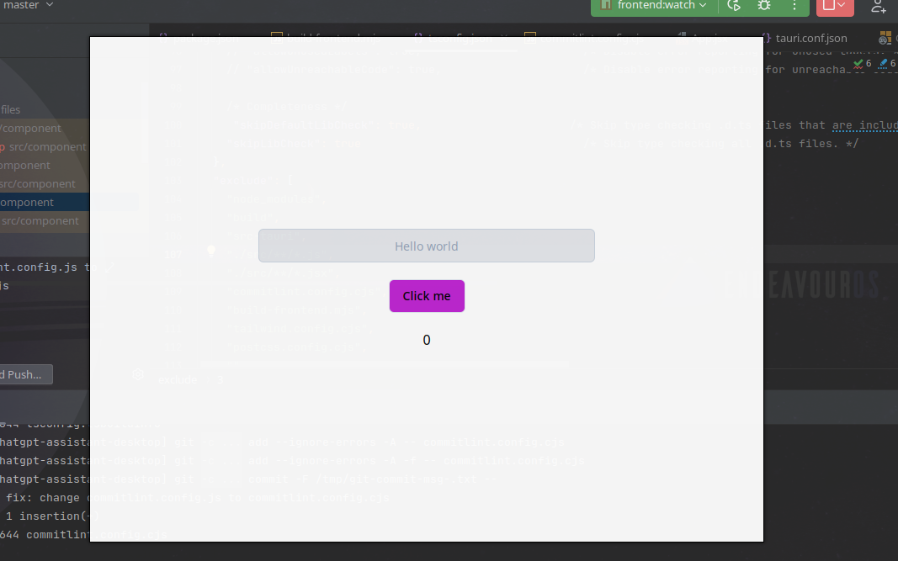

# Template for app with tauri + react + radixui + tailwindcss + esbuild

### How to use in development

You should run all those npm scripts in parallel to watch the app
```bash
npm run frontend:server # sometime live-server reload may have problem, just restart it
npm run frontend:typescript
npm run frontend:watch
npm run tauri:dev
# optional
npm run react-devtools
```

### How to deploy app
```bash
tauri build
```



> Tailwind and RadixUi setup are backed by [shadcn/ui](https://github.com/shadcn/ui)
